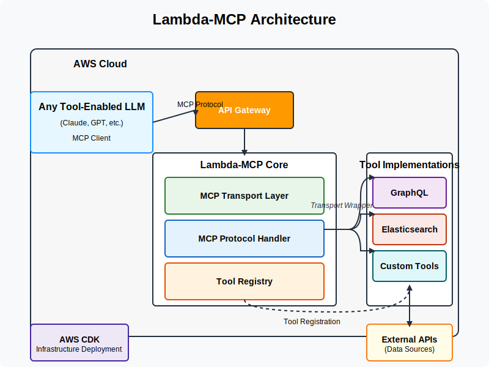

# Lambda-MCP: Architectural Design Document

## Executive Summary

This document outlines the architecture and implementation plan for Lambda-MCP, a lightweight library for implementing Model Context Protocol (MCP) servers on AWS Lambda. The Lambda-MCP library provides a reusable transport layer that makes it easy to build focused, single-purpose MCP servers, each designed to integrate with a specific API or service. This enables tool-enabled LLMs to interact with various data sources through the standardized MCP interface.

## 1. Architecture Overview

Lambda-MCP implements the transport and protocol handling components of the Model Context Protocol as a reusable library, allowing developers to quickly build MCP-compliant servers without needing to implement the protocol details themselves. Each server built with Lambda-MCP would typically focus on a specific service integration (like GraphQL, Elasticsearch, etc.).

### Key Components

1. **MCP Transport Layer**: Handles HTTP communication via AWS Lambda and API Gateway
2. **MCP Protocol Handler**: Implements the core MCP protocol message formats and lifecycle
3. **Server Base Class**: Provides a foundation for building specific MCP server implementations
4. **Example Implementations**: Demonstrations of specific integrations (GraphQL, Elasticsearch)

### Architecture Diagram



## 2. Detailed Component Specifications

### 2.1 MCP Transport Layer

**Purpose**: Implement the HTTP transport mechanism for MCP as a Lambda function.

**Responsibilities**:
- Handle AWS Lambda event processing
- Parse and validate incoming HTTP requests
- Format HTTP responses according to MCP specifications
- Implement error handling and logging

**Interfaces**:
- Input: AWS Lambda events from API Gateway
- Output: HTTP responses via Lambda return values
- Internal: Processed MCP messages to Protocol Handler

### 2.2 MCP Protocol Handler

**Purpose**: Implement the core MCP protocol specification to process messages.

**Responsibilities**:
- Parse and validate MCP message formats
- Implement protocol-specific behaviors (initialization, etc.)
- Handle tool call message processing
- Format responses according to MCP specification

**Interfaces**:
- Input: Parsed HTTP requests from Transport Layer
- Output: Formatted MCP responses to Transport Layer
- Internal: Processed tool calls to tool implementations

### 2.3 Server Base Class

**Purpose**: Provide a foundation for implementing specific MCP servers.

**Responsibilities**:
- Offer simplified API for creating MCP servers
- Handle tool registration and discovery (according to MCP protocol)
- Manage server lifecycle
- Connect transport and protocol layers

**Interfaces**:
- Public: API for creating and configuring MCP servers
- Internal: Integration with transport and protocol layers

### 2.4 Example Implementations

**Purpose**: Demonstrate how to build specific MCP servers using the library.

**Examples**:
- "Hello World" MCP server with simple tools
- GraphQL MCP server for connecting to GraphQL APIs
- Elasticsearch MCP server for search functionality

## 3. MCP Protocol Compliance

Lambda-MCP is designed to fully comply with the Model Context Protocol specification:

### 3.1 Protocol Message Flow

The MCP protocol follows this standard flow:

1. **Initialization**:
   - Client sends `initialize` request with client info and capabilities
   - Server responds with server info and supported capabilities
   - Client sends `initialized` notification to confirm

2. **Tool Discovery**:
   - Client sends `tool.list` request
   - Server responds with available tools and their definitions

3. **Tool Execution**:
   - Client sends `tool.call` request with tool name and arguments
   - Server executes the tool and returns results

### 3.2 JSON-RPC 2.0 Compliance

All MCP messages use JSON-RPC 2.0 format:

```json
// Request
{
  "jsonrpc": "2.0",
  "id": "request-id",
  "method": "method-name",
  "params": { ... }
}

// Response
{
  "jsonrpc": "2.0",
  "id": "request-id",
  "result": { ... }
}

// Error
{
  "jsonrpc": "2.0",
  "id": "request-id",
  "error": {
    "code": -32000,
    "message": "Error message"
  }
}

// Notification (no response expected)
{
  "jsonrpc": "2.0",
  "method": "method-name",
  "params": { ... }
}
```

### 3.3 Tool Definition Format

Tools are defined using this format:

```typescript
interface MCPToolDefinition {
  name: string;
  description: string;
  parameters: Record<string, {
    type: string;
    description: string;
    required?: boolean;
    default?: any;
    enum?: any[];
    // Other validation properties
  }>;
}
```

## 4. Implementation Strategy

### 4.1 Library Core

1. **Transport Layer**
   - Implement Lambda event handling
   - Create HTTP request/response processing
   - Add error handling and logging

2. **Protocol Handler**
   - Implement MCP message parsing
   - Create protocol lifecycle handling
   - Add tool calling support

3. **Server Base**
   - Design simple API for server creation
   - Implement tool registration and discovery
   - Create Lambda handler factory

### 4.2 Example Implementations

1. **"Hello World" Example**
   - Create simple greeting tool
   - Implement basic server configuration
   - Add deployment example with CDK

2. **GraphQL Example**
   - Implement GraphQL client integration
   - Create query execution and validation
   - Add schema introspection support

3. **Elasticsearch Example**
   - Implement Elasticsearch client integration
   - Create search query execution
   - Add result formatting

## 5. Usage Patterns

### Pattern: Creating a Basic MCP Server

```typescript
import { createMCPLambdaHandler } from 'lambda-mcp';

// Define tool implementations
const myTool = {
  name: 'my_tool',
  description: 'Description of my tool',
  parameters: {
    // Parameter definitions
  },
  handler: async (params) => {
    // Tool implementation
    return result;
  }
};

// Create Lambda handler
export const handler = createMCPLambdaHandler({
  name: 'my-mcp-server',
  version: '1.0.0',
  tools: [myTool]
});
```

### Pattern: Connecting to an API

```typescript
import { createMCPLambdaHandler } from 'lambda-mcp';
import { ApiClient } from 'some-api-client';

// Create API client
const apiClient = new ApiClient({
  baseUrl: process.env.API_URL,
  apiKey: process.env.API_KEY
});

// Define API tool
const apiTool = {
  name: 'api_query',
  description: 'Query the API',
  parameters: {
    query: {
      type: 'string',
      description: 'The query to execute'
    }
  },
  handler: async (params) => {
    const result = await apiClient.query(params.query);
    return result;
  }
};

// Create Lambda handler
export const handler = createMCPLambdaHandler({
  name: 'api-mcp-server',
  version: '1.0.0',
  tools: [apiTool]
});
```

## 6. Local Development

Lambda-MCP includes a comprehensive local development environment:

1. **Express-based Development Server**:
   - Simulates AWS Lambda and API Gateway
   - Handles MCP protocol messages
   - Provides request/response logging

2. **Web Testing Interface**:
   - Interactive UI for sending MCP requests
   - Templates for common MCP operations
   - Request history tracking

3. **Mock MCP Client**:
   - Simulates a full MCP client session
   - Tests initialization, tool discovery, and tool calls
   - Provides detailed logging

## 7. LLM-Assisted Development

Lambda-MCP is designed to work well with LLM-assisted development:

1. **Well-Defined Patterns**:
   - Clear structure for tool definitions
   - Consistent patterns for tool implementations
   - Standard approach to error handling

2. **Documentation for LLMs**:
   - Comprehensive documentation that LLMs can reference
   - Examples that demonstrate best practices
   - Clear explanations of core concepts

3. **Iterative Development**:
   - Start with a simple MCP server and add features
   - Test each addition with the local development environment
   - Refine implementations with LLM assistance

## 8. Technical Considerations

### 8.1 Performance

- **Cold Start**: Minimize dependencies to reduce Lambda cold start time
- **Connection Pooling**: Implement for API clients with persistent connections
- **Memory Sizing**: Provide guidance on appropriate Lambda memory configuration

### 8.2 Security

- **Authentication**: Support for authenticating MCP clients
- **Input Validation**: Validate all inputs to prevent injection attacks
- **Secrets Management**: Use environment variables and AWS Secrets Manager

### 8.3 Deployment

- **Infrastructure as Code**: Provide CDK examples for deployment
- **Configuration**: Support environment-based configuration
- **Monitoring**: Add CloudWatch logging integration

## 9. Conclusion

The Lambda-MCP library provides a lightweight, focused solution for building MCP-compliant servers on AWS Lambda. By handling the transport and protocol aspects of MCP, it allows developers to focus on implementing specific tool functionality they need. The modular approach enables the creation of multiple specialized MCP servers, each dedicated to a specific service integration, rather than trying to build a monolithic solution.

This architecture aligns with the principles of serverless design and the MCP standard's focus on specific, well-defined tools. It provides a foundation that makes it easy for organizations to expose their APIs and services to tool-enabled LLMs through the standardized MCP interface.
